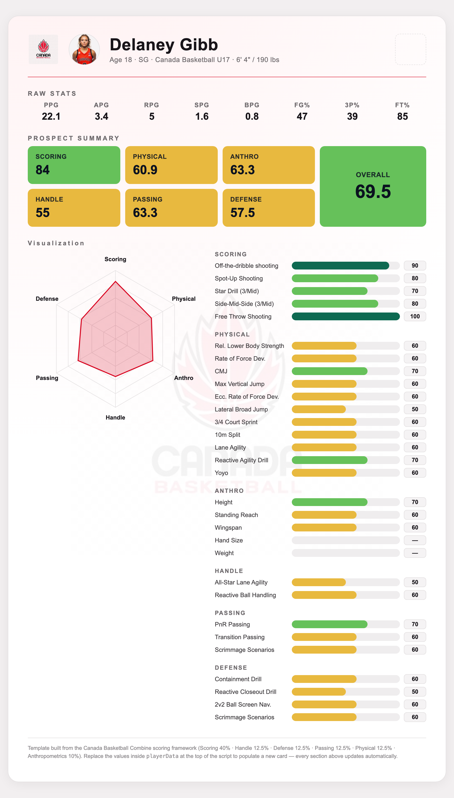

# Athlete Evaluation — Prospect Cards

Turns a basketball combine CSV into one self-contained, print-ready scouting card per
player. Evaluators enter letter grades (A–J) per drill; the pipeline converts those to
percentiles, rolls them up into weighted category scores and an overall rating, and
injects the result into an HTML card template.



## How the scoring works

**Letter grades → percentiles.** Each drill is graded A–J and mapped linearly:
`A = 10, B = 20, … J = 100`. Blank or unrecognized grades become `NA` and render as `—`
on the card instead of counting as a zero.

**Category score** = the mean of that category's graded KPIs (missing KPIs are skipped).

**Overall** = weighted mean of the category scores, renormalized over whatever
categories actually have data:

| Category | Weight | KPIs |
| --- | --- | --- |
| Scoring | 40% | Off-the-dribble, spot-up, star drill, side-mid-side, free throw |
| Physical | 12.5% | Rel. lower body strength, RFD, CMJ, max vert, ecc. RFD, lateral broad jump, 3/4 court sprint, 10m split, lane agility, reactive agility, Yoyo |
| Handle | 12.5% | All-star lane agility, reactive ball handling |
| Passing | 12.5% | PnR, transition, scrimmage scenarios |
| Defense | 12.5% | Containment, reactive closeout, 2v2 ball screen nav., scrimmage scenarios |
| Anthro | 10% | Height, standing reach, wingspan, hand size, weight |

## Usage

```bash
# defaults: combine_dummy_data.csv + prospect_card_template_white.html -> cards_out/
Rscript render_prospect_cards.R

# or point it at your own files
Rscript render_prospect_cards.R path/to/data.csv path/to/template.html out_dir
```

One `<slug>_card.html` is written per CSV row. Each card is fully self-contained —
inlined fonts, logos and an inline-SVG radar chart, no external requests — so it opens
anywhere and can be emailed as a single file.

### Exporting to PDF / PNG

The cards render to fixed 900 × 1569 px, so headless Chrome reproduces them exactly:

```bash
CHROME="/Applications/Google Chrome.app/Contents/MacOS/Google Chrome"

# PDF — single page, no scaling
"$CHROME" --headless --no-pdf-header-footer --virtual-time-budget=10000 \
  --print-to-pdf=card.pdf "file://$PWD/cards_out/delaney_gibb_card.html"

# PNG — 2x for retina / slide decks
"$CHROME" --headless --hide-scrollbars --force-device-scale-factor=2 \
  --window-size=932,1633 --virtual-time-budget=10000 \
  --screenshot=card.png "file://$PWD/cards_out/delaney_gibb_card.html"
```

Add `@page { size: 932px 1633px; margin: 0 }` and `print-color-adjust: exact` to the
template's print styles to keep the backdrop and tile colors in the PDF.

## CSV schema

`combine_dummy_data.csv` is a 3-player dummy set showing the expected layout.

- **Meta:** `player_id, name, age, position, team, height, weight, headshot`
- **Raw stats** (printed verbatim on the card): `ppg, apg, rpg, spg, bpg, fg_pct, three_pct, ft_pct`
- **Graded KPIs** (A–J): `scoring_*`, `handle_*`, `defense_*`, `passing_*`, `physical_*`, `anthro_*`

Every column is read as character so letter grades and formatted values (`6' 4"`,
`190 lbs`) survive untouched. The column list lives in `render_prospect_cards.R`
(`META_COLS`, `RAW_STAT_COLS`, `CATEGORIES`) — that is the single source of truth for
the schema.

**Headshots.** The optional `headshot` column takes a local image path (resolved
relative to the CSV), a `data:` URI, or an http(s) URL. Local files are base64-inlined
into the card so it stays a single self-contained file; leave the cell blank and the
card falls back to a placeholder glyph.

## Repo layout

```
render_prospect_cards.R              # CSV -> populated HTML cards
loadPackages.R                       # package bootstrap (pacman + tidyverse, jsonlite, ...)
combine_dummy_data.csv               # sample input
headshots/                           # player headshots referenced by the CSV
prospect_card_template_white.html    # card template (light theme)
examples/                            # rendered sample cards (HTML / PDF / PNG)
```

## Requirements

R with `readr`, `dplyr`, `purrr`, `jsonlite`, `stringr` — `loadPackages.R` installs
anything missing via `pacman`. PDF/PNG export needs Google Chrome.
